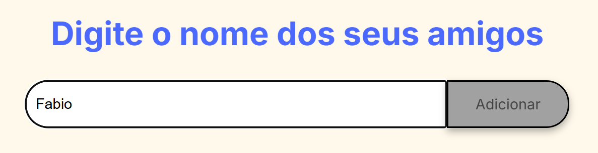
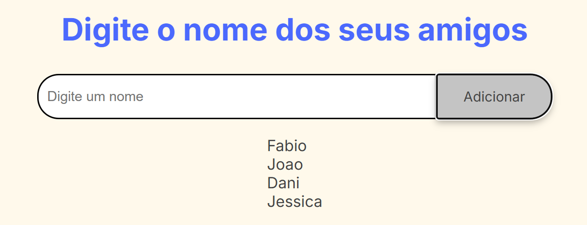
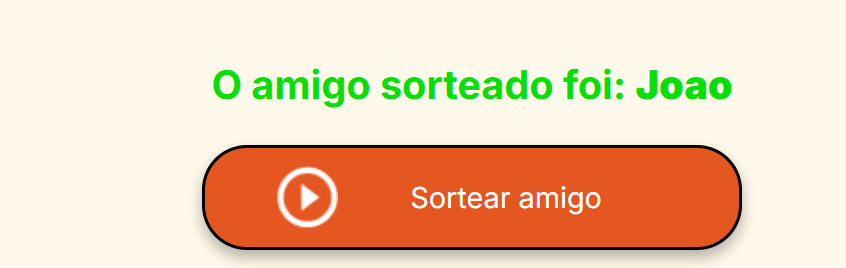

### **README.md**

# Jogo do Amigo Secreto

Um projeto simples e divertido para sortear nomes em um grupo de amigos de forma aleatória.

-----

### Funcionalidades

  - **Adicionar Amigos**: Permite inserir nomes na lista do sorteio.




  - **Sortear Amigo**: Escolhe um único amigo aleatoriamente da lista e exibe o nome na tela.

  
  


-----

### Tecnologias Utilizadas

  - **HTML5**: Estrutura da página.
  - **CSS3**: Estilização e layout.
  - **JavaScript**: Lógica do jogo (adicionar nomes, sortear, etc.).

-----

### Como Usar

Siga estes passos simples para começar a usar o jogo:

1.  **Clone o Repositório** (se estiver no GitHub):
    ```
    git clone [url-do-seu-repositorio]
    ```
2.  **Abra o Arquivo `index.html`**:
    Simplesmente abra o arquivo `index.html` em seu navegador de internet preferido (como Chrome, Firefox, ou Edge).
3.  **Adicione Nomes**:
    No campo de texto, digite o nome de cada amigo e clique no botão **"Adicionar"**. A lista será atualizada na tela.
4.  **Realize o Sorteio**:
    Após adicionar todos os amigos, clique no botão **"Sortear amigo"**. O nome do amigo sorteado será exibido logo abaixo.
5.  **Comece de Novo**:
    Para um novo sorteio, clique no botão **"Reiniciar Jogo"** para limpar a lista e o resultado.

-----

### Exemplo de Uso

#### Adicionando Nomes

*Você pode substituir esta imagem por uma captura de tela do seu próprio projeto.*

#### Resultado do Sorteio

*Substitua esta imagem por uma captura de tela do resultado do sorteio.*

-----

### Autor

  - **[Seu Nome Aqui]** - Desenvolvedor Front-end

-----